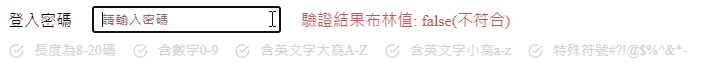

# RegexValidator 正規式驗證模組(powered by Vue option api)

專為 vue option api 打造，快速使用該模組並且以自訂的正規式驗證資料並即時顯示於 UI

## Demo



## 功能

- 自由綁定您的 input 資料
- 自訂驗證正規式
- 自訂驗證正規式名稱 (畫面 UI)
- 自訂 svg 樣式
- 完成驗證後可輸出驗證結果 (布林值)

## 快速開始

將 RegexValidator 用於您的專案

### 1. 於 html 引入 css

```html
<link rel="stylesheet" href="./css/index.css" />
```

### 2. 於 main.js 引入模組並註冊元件

```javascript
import { RegexValidator } from './regexValidator.js'

Vue.createApp({
  data() {
    return {
      //   your data
    }
  },
  components: {
    // 註冊元件
    RegexValidator,
  },

  methods: {
    //   your methods
  },
}).mount('#app')
```
