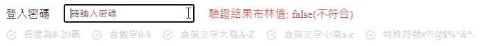

# RegexValidator (powered by Vue option api)

專為 vue option api 打造，快速使用該模組以使用您自訂的正規式驗證 input 資料並即時顯示於 UI



## Features

- 自由綁定您的 input 資料
- 自訂驗證正規式
- 自訂驗證正規式名稱 (畫面 UI)
- 自訂 svg 樣式
- 完成驗證後可輸出驗證結果 (布林值)
- 不依賴 jQuey

## Demo

動手玩玩看 ==> https://kevinyu1580.github.io/pwdRegexValidation/

## 快速開始

將 RegexValidator 用於您的專案

### 1. 於 html 引入 css

```html
<link rel="stylesheet" href="./css/index.css" />
```

### 2. 於 main.js 引入模組並註冊元件

```javascript
import { RegexValidator } from './regexValidator.js'

Vue.createApp({
  data() {
    return {
      //   your data
    }
  },
  components: {
    // 註冊元件
    RegexValidator,
  },

  methods: {
    //   your methods
  },
}).mount('#app')
```

### 3. 將 RegexValidator 模版放入 Html

```html
<div id="app">
  <!-- 模板Template -->
  <Regex-validator :regex-list="myPwdRuleList" :input-value="myInputVal" @output="updatePwdModuleOutput" />
</div>
```

## 使用須知!!

使用前請閱讀以下說明

## 1. props

```html
<Regex-validator :regex-list="myPwdRuleList" :input-value="myInputVal" @output="updatePwdModuleOutput" />
```

### **:input-value**

**用於綁定父元件 data 中的資料，模組將驗證此輸入值**

type: `String`

required: `true`

### **:regex-list**

**傳入您自訂的正規式陣列**

type: `Array`

required: `false`

傳入的陣列格式務必為和下列相符

```javascript
;[
  { Name: '正規式名稱', Regex: '正規式' },
  // ...其餘物件
]
```

當無此 props 時，預設為以下

```javascript
;[
  { Name: '長度為8-20碼', Regex: '/^.{8,20}$/' },
  { Name: '含數字0-9', Regex: '/[0-9]/' },
  { Name: '含英文字大寫A-Z', Regex: '/[A-Z]/' },
  { Name: '含英文字小寫a-z', Regex: '/[a-z]/' },
  { Name: '特殊符號#?!@$%^&*-', Regex: '/[#?!@$%^&*-]/' },
]
```

## 2. 自訂 svg 樣式

預設樣式為 

使用 v-slot 來自訂您的 svg

```javascript
      <Regex-validator :regex-list="myPwdRuleList" :input-value="myInputVal" />

      <template v-slot:icon>
          // 您的 svg
          <svg
            xmlns="http://www.w3.org/2000/svg"
            width="24"
            height="24"
            viewBox="0 0 24 24"
            fill="none"
          >
            <path
              d="M15.142 9.98299L10.875 14.25L9.42049 12.7955M12 3C7.02944 3 3 7.02944 3 12C3 16.9706 7.02944 21 12 21C16.9706 21 21 16.9706 21 12C21 7.02944 16.9706 3 12 3Z"
              stroke="black"
              stroke-width="2"
              stroke-linecap="round"
              stroke-linejoin="round"
            />
          </svg>
        </template>
      </Regex-validator>
```

## 3. emit 事件綁定

藉由 emit 事件綁定模組驗證後的輸出值

輸出 type: `Boolean`

emit required: `false`

### **@output**

父元件 html

```html
<Regex-validator @output="myFunc" />
```

main.js 內自訂 function，與父元件內 data 綁定

```javascript
Vue.createApp({
  data() {
    return {
      //正規式模組輸出，type: Boolean
      moduleOutput: false,
    }
  },
  components: {
    RegexValidator,
  },

  methods: {
    // 自訂function
    myFunc(output) {
      this.moduleOutput = output
    },
  },
}).mount('#app')
```
